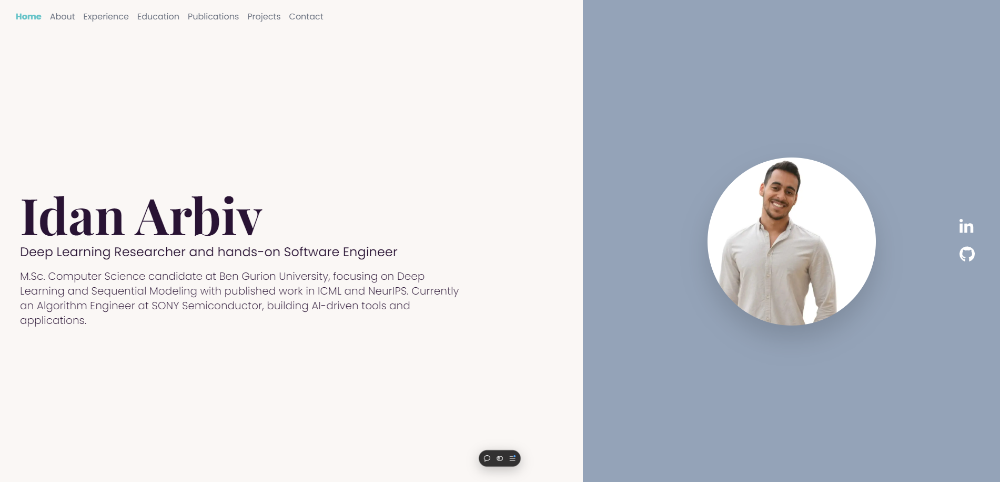

# ImagenI2R: A Diffusion Model for Regular Time Series Generation from Irregular Data



## 📄 Paper Information

**Title**: A Diffusion Model for Regular Time Series Generation from Irregular Data with Completion and Masking

**Authors**: 
- Gal Fadlon* (Ben Gurion University)
- Idan Arbiv* (Ben Gurion University) 
- Nimrod Berman (Ben Gurion University)
- Omri Azencot (Ben Gurion University)

*Equal contribution

**Affiliation**: 🐪 Ben Gurion University

**Status**: Accepted to NeurIPS 2025

## 🎯 Abstract

Generating realistic time series data is critical for applications in healthcare, finance, and science. However, irregular sampling and missing values present significant challenges. While prior methods address these irregularities, they often yield suboptimal results and incur high computational costs. 

Recent advances in regular time series generation, such as the diffusion-based ImagenTime model, demonstrate strong, fast, and scalable generative capabilities by transforming time series into image representations, making them a promising solution. However, extending ImagenTime to irregular sequences using simple masking introduces 'unnatural' neighborhoods, where missing values replaced by zeros disrupt the learning process.

To overcome this, we propose a novel two-step framework: first, a Time Series Transformer completes irregular sequences, creating natural neighborhoods; second, a vision-based diffusion model with masking minimizes dependence on the completed values. This approach leverages the strengths of both completion and masking, enabling robust and efficient generation of realistic time series.

**Our method achieves state-of-the-art performance, achieving a relative improvement in discriminative score by 70% and in computational cost by 85%.**

## 🚀 Key Contributions

1. **Novel Generative Model**: We introduce a novel generative model for irregularly-sampled time series, leveraging vision-based diffusion approaches to efficiently and effectively handle sequences ranging from short to long lengths.

2. **Weak Conditioning Strategy**: In contrast to existing methods that assume completed information is drawn from the data distribution, we treat it as a weak conditioning signal and directly optimize on the observed signal using a masking strategy.

3. **State-of-the-Art Performance**: Our approach achieves state-of-the-art performance across multiple generative tasks, delivering an average improvement of 70% in discriminative benchmarks while reducing computational requirements by 85% relative to competing methods.

## 🔗 Links

- **GitHub Repository**: [azencot-group/ImagenI2R](https://github.com/azencot-group/ImagenI2R)
- **ArXiv Paper**: Coming Soon
- **Research Group**: [The Sequential Learning Group](https://www.linkedin.com/company/the-sequential-learning-group/)

## 🛠️ Technology Stack

This research website is built with modern web technologies:

- **Framework**: Next.js 14
- **Styling**: Tailwind CSS
- **Animations**: Framer Motion
- **Icons**: FontAwesome
- **Deployment**: Vercel

## 🏃‍♂️ Quick Start

To run this research website locally:

```bash
# Clone the repository
git clone https://github.com/azencot-group/ImagenI2R

# Navigate to the web directory
cd ImagenI2R-Web

# Install dependencies
npm install

# Start the development server
npm run dev
```

Open [http://localhost:3000](http://localhost:3000) in your browser to view the website.

## 📁 Project Structure

```
ImagenI2R-Web/
├── app/
│   ├── components/          # React components
│   │   ├── layout/         # Layout components (NavBar, Footer, etc.)
│   │   ├── Citation.tsx    # Citation component
│   │   ├── Hero.tsx        # Hero section
│   │   ├── ResearchAbstract.tsx
│   │   ├── ResearchResults.tsx
│   │   ├── ResearchSection.tsx
│   │   └── SocialIcon.tsx  # Social media icons
│   ├── globals.css         # Global styles
│   ├── layout.tsx          # Root layout
│   └── page.tsx            # Main page
├── public/                 # Static assets
│   ├── *.png              # Research figures and results
│   ├── *.pdf              # Research papers
│   └── *.tex              # LaTeX source
├── utils/
│   ├── fonts.ts           # Font configurations
│   ├── heroText.ts        # Hero section content
│   └── researchData.ts    # Research data and content
└── README.md
```

## 📊 Research Results

The website showcases various research results including:

- Model architecture diagrams
- Ablation studies
- Performance comparisons
- Qualitative evaluations
- Training time analysis
- Results under noise conditions

## 👥 Research Group

This work is part of **The Sequential Learning Group** at Ben Gurion University, which focuses on:

- Diffusion-based generative modeling of time series
- Sequential learning and time series analysis
- Machine learning and deep learning research
- Collaboration with industry partners

## 📞 Contact

For questions about this research or collaboration opportunities:

- **Idan Arbiv**: idan.arbiv@gmail.com
- **Research Group**: [The Sequential Learning Group LinkedIn](https://www.linkedin.com/company/the-sequential-learning-group/)
- **Institution**: Ben Gurion University

## 📜 Citation

If you use this work in your research, please cite:

```bibtex
@misc{fadlon2025diffusionmodelregulartimeseries,
  title={A Diffusion Model for Regular Time Series Generation from Irregular Data with Completion and Masking}, 
  author={Gal Fadlon and Idan Arbiv and Nimrod Berman and Omri Azencot},
  year={2025},
  eprint={TBD},
  archivePrefix={arXiv},
  primaryClass={cs.LG},
  url={TBD}, 
}
```

## 📄 License

This project is licensed under the MIT License - see the [LICENSE](LICENSE) file for details.

---

*This website showcases research accepted to NeurIPS 2025. For the latest updates and code, visit our [GitHub repository](https://github.com/azencot-group/ImagenI2R).*